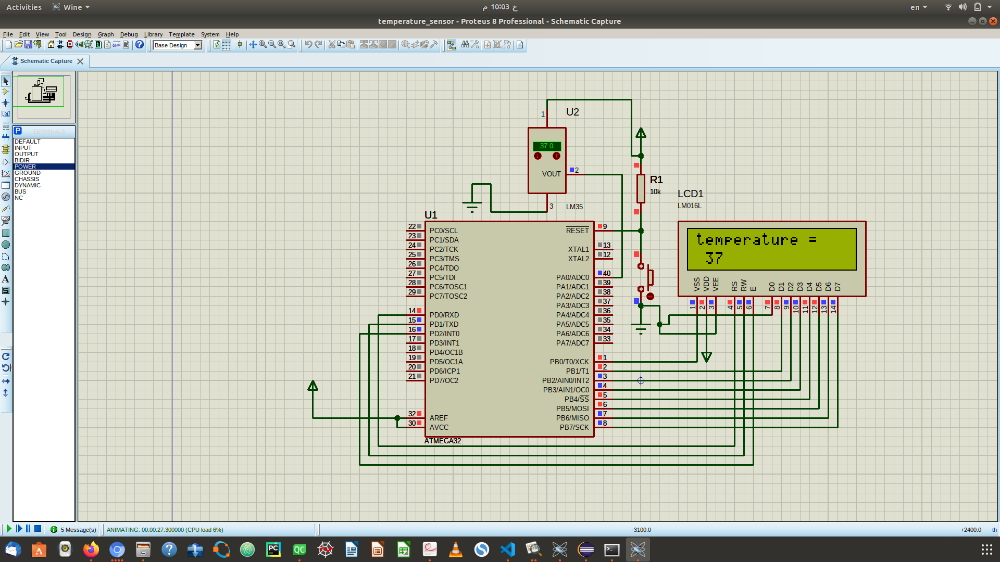

# temperature-sensor-based-application

**this is the task 1 for measurements** it's a
simple application that uses thermistor circuit to measure the temperature of the human body , it's dedicated to decrease the time taken for measuring the temperature of a group of persons using more than 1 sensor and to be able to process the temperatures measured from them together

## connections for the LCD
----------------------------

D0 -> PB0

D1 -> PB1

D2 -> PB2

D3 -> PB3

D4 -> PB4

D5 -> PB5

D6 -> PB6

D7 -> PB7

RS -> PD0

RW -> PD1

E -> PD2

VDD -> +5v

VEE/VSS -> Gnd

## LM35 (+-0.5 c)
------------------
output pin -> ADC0(PA0)

## Microcontroller
--------------------

AREF/AVCC -> +5V (not important actually)

xtal1/xtal2 -> floating (for mcu frequency config)

RESET -> +5v (NOT RESETTING) **or** Gnd (DO RESET)

VCC -> +5v

GND -> Gnd

AGND -> Gnd

## usbasp
----------------

MOSI -> MOSI

MISO -> MISO

SCK -> SCK

VCC -> VCC

GND -> GND

RESET -> RESET

## simulation
---------------------

